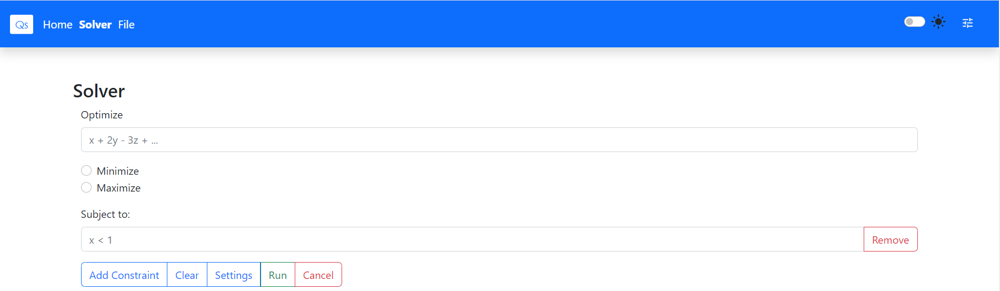
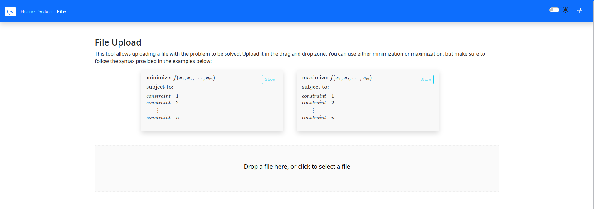
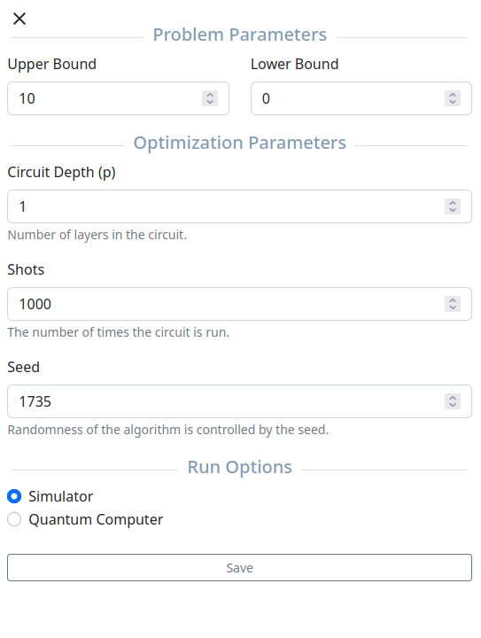

# Quantum-Linear-Programming-Solver [](https://doi.org/10.5281/zenodo.7972044)

**Final project for my computer science degree**, graded **9.5/10**.  
This project implements a **quantum algorithm** for solving **integer linear programming (ILP)** problems using **Qiskit**.

The project is divided into two main components:

- **Backend:**
  - Written in Python.
  - Utilizes the **Quantum Approximate Optimization Algorithm (QAOA)** implemented with Qiskit.
  - Manages the quantum execution and optimization of the ILP problems.

- **Frontend:**
  - Built with TypeScript and React.
  - Provides a graphical interface where users can:
    - Input mathematical formulas defining the ILP problem.
    - Configure optimization parameters.
    - Visualize the results and the associated quantum circuits.

---

## Demo Video

Watch a full example of the project in action here:  
[](https://www.youtube.com/watch?v=tfgWx35DoTY)

Click the image above or [here](https://www.youtube.com/watch?v=tfgWx35DoTY) to watch the demo.

---

## Features

### 1. Mathematical Formula Parsing
The project includes a custom grammar to recognize and process mathematical formulas directly entered by the user:


### 2. File Input Support
For convenience, users can load mathematical formulas from external files, streamlining the process of defining ILP problems:


### 3. Customizable Parameters
Users can fine-tune parameters for the quantum optimization process, such as:
- Number of iterations.
- Depth of the quantum circuit.
- Algorithm-specific parameters.
This flexibility enhances the usability and allows experimentation:


### 4. Real-Time Results
After running the algorithm, the frontend displays:
- The optimized solution to the ILP problem.
- A visual representation of the quantum circuit used.

---

## Example Usage
Write a formula such as:
```python
**minimize** x_0 + x_1 + 2(x_0 + x_1 + s_0 - 1)^2
**subject to** 0 <= x_0 <= 1, 0 <= x_1 <= 1, 0 <= s_0 <= 1
```
Click on **Run** (see first image).

# Installation
You need to install Docker to use this app, see [https://www.docker.com/](https://www.docker.com/).

1. git clone https://github.com/sanchezhs/TFG.git && cd TFG
2. cd frontend && npm install && npm run build
3. cd ..
4. docker−compose up −d −−build
5. In the browser, go to localhost:3000
